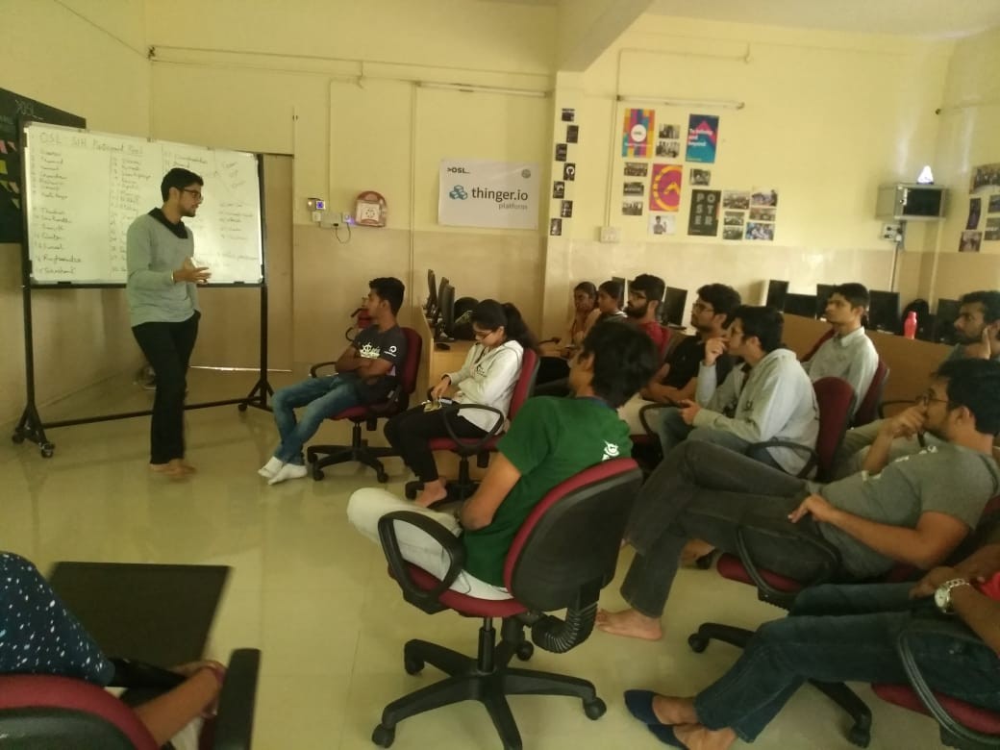
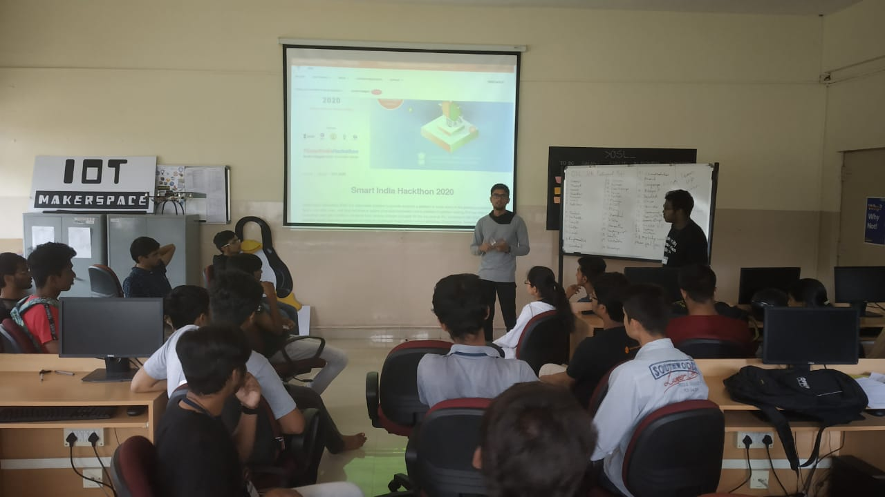
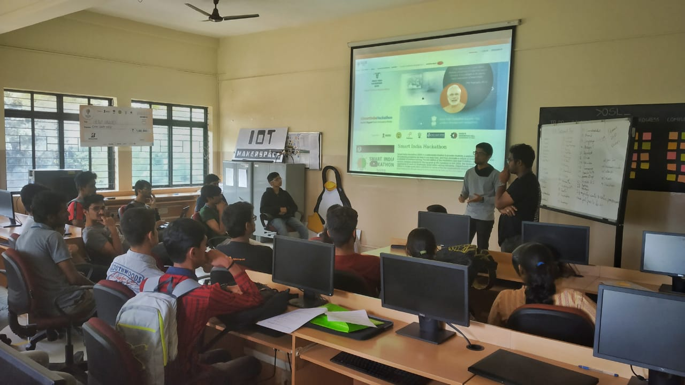

# Smart India Hackathon Briefing

One of the major objectives of the Open source lab is to  promote participation in hackathons.This enables young minds to add problem solving, out-of-box thinking and innovation to their skillset.

Smart India Hackathon is one of the  nationwide initiative where students get an opportunity to work on challenges faced within various Ministries, Departments, Industries, PSUs and NGOs to create world class solutions for some of the top organizations including industries in the world, thus helping the Private sector hire the best minds from across the nation.

A detailed insight of the Do's and Don'ts to consider while participating in this contest was provided to the interested members of the Open Source Lab. Some of the members also shared their past experiences from SIH 2019,SIH 2018 and so on.

The one-hour session proved out to be fruitful and all the FAQs were answered.

**Venue:** Open Source Lab

**Date:** 6 Dec 2019

